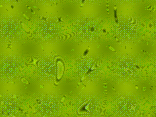

qtz-collection
==============

A collection of my quartz composer patches

## Wobble pattern

This is a pattern rendered in a Core Image Kernel is based on the square function of the pixel position, modified by a sinus function for x and y direction. The color is chosen by a color range. It can be used as a background patch with slow wave generators and a small color range or be used as a screensaver with faster animations.

## Swirl

This is a spiral image rotated by 360 degrees with a combination of effects giving a slightly hypnotic effect.

* tilting of the image in x and y direction controlled by sine generators
* a core image kernel displacing pixels based on trigometric functions controlled by slow oscillators

## Rotating Circles

Toying around with the "Replicate in Space" to create translucent circles, which are then
processed by a gaussian blur and a dithering core image kernel.

## Blurred Camera

No code in this. Just routing the camera input through two bulge effects with slowly changing positions controlled by oscillators, then a bloom effect, a gaussian blur and finally some colouring. Look there is an alien in your camera. No, it was just a end ninetyish alternative music video.

